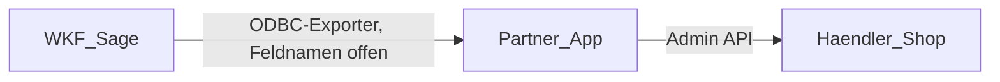

# Präsent-App: Architektur und Gerüst

Verbindliche Repo-Kopie des Umsetzungsplans. Chat-Pläne von Cursor liegen außerhalb dieses Git-Workspaces (`C:\Users\ciftci\.cursor\plans\`). Setup-Einstieg: [README.md](../README.md).

Stand: 17. September 2026. Die Shopify-Seite steht. Der Sage-Exporter steht als
Gerüst unter [tools/sage-export/](../tools/sage-export/README.md); offen sind
allein die **Feldnamen der WKF-Sage**.

## Verständnis

- **Partner-App** aus dem Dev/Partner-Dashboard, **Custom Distribution**, OAuth über das offizielle Shopify-CLI-Template (React Router). **Kein** Merchant-Admin-Custom-App mit `shpat`-Token.
- **Kein** Theme forken, **keine** Theme App Extension, **kein** App-Block für Inhaltsliste oder Nährwert-Loop. Das Händler-Theme zeigt das durchgereichte HTML.
- Stückliste entsteht **nur in Sage** (`KHKArtikelStueckliste`: Parent, Element/Kind-SKU, Menge). Die App rät sie nicht aus Shop-Produkten.
- Nährwert- und Kennzeichnungstexte kommen aus der Sage-Stückliste (explodierte BOM, oft fertiger HTML-/Fließtext). Das ist Lieferinhalt, kein Layout, das die App neu baut.
- Marketing-HTML wird nur durchgereicht (`body_html` / `descriptionHtml` oder HTML-Metafield). Keine redaktionelle Pflege.
- Zuerst **Adapter + Fixture** in derselben Form wie später Sage. Adapter 1:1 austauschbar.
- **Sage ist immer unsere WKF-Instanz.** Der Händler hat keine eigene Sage. Die App liest Stamm- und Stücklistendaten bei uns und schreibt **nur** in den Shop des Händlers.
- GitHub-Repo existiert bereits (`devfreund/Shopify-Integration-Pr-sente`). Kein Kopieren aus Vinsecco.



Die Dateien `Anleitung-Praesent-Shopify-App.html` und `Praesent-Architektur-Blaupause.html` beschreiben noch den alten Soll (App-Block, Nährwert-Loop). Sie bleiben als Historie liegen und sind **nicht** Implementierungsziel.

## Fachmodell

- **Parent** = verkaufbares Set (SKU, Preis, `product_type` Präsent).
- **Kinder** = Elemente der Stückliste, bereits eigene Sage-/Shop-Artikel.
- **Stückliste** = Verweise + Mengen am Parent (`custom.components` / `custom.component_qty` oder gleichwertig).
- Shop spiegelt Sage.

### HTML / Nährwerte — nicht zweimal erfinden

Wenn Sage die Texte schon als **einen Stücklisten-Block** liefert, gehört der unverändert an den Parent:

- Marketing → `html` → Shopify `descriptionHtml`
- Kennzeichnung/Nährwerte des BOM-Blocks → `kennzeichnung_html` → Metafield `custom.kennzeichnung_html`

`nutrition_html` je Kind und anschließendes Joinen **nur**, wenn Sage wirklich zeilenweise liefert. Dann: technische Konkatenation in BOM-Reihenfolge, kein eigenes Layout, kein Zusammenbauen „wie es schön aussieht“.

Die App legt Nährwerte nicht unabhängig von der Sage-BOM neu an.

## Was die App tut

Die App ist die Schreibseite in **den Shop des Händlers**. Lesen (später) nur aus **unserer WKF-Sage**. Kein Sage-Mandant und kein ODBC beim Händler.

1. Kinder upserten
2. Parent upserten
3. Stücklisten-Verweise + Mengen schreiben
4. HTML (Marketing + Nährwerte aus BOM) schreiben — unverändert bzw. nur technisch gemappt
5. Bei rotem Qualitätstor auf DRAFT zurückziehen. Aktivieren tut die App nie.

Zwei Schienen:

- **Artikel-Sync** (`ChildUpserted`) — Kind
- **Set-Sync** (`BomChanged`) — Stückliste + dazugehörige Texte

`ArticleDeactivated` setzt Draft / unveröffentlicht.

### Qualitätstor

**Die App aktiviert nie.** `ACTIVE` setzt ausschließlich der Händler im Shop. Neu angelegte Produkte sind `DRAFT`. Ist das Tor grün, lässt die App den Status unangetastet — auch eine Händler-Aktivierung bleibt bestehen.

Tor grün heißt: alle Stücklisten-Kinder sind per SKU auflösbar und das Set ist in Sage aktiv. Ist das Tor rot, zieht die App den Parent auf `DRAFT` zurück und schreibt `missing_child` ins Log. Das gilt auch, wenn der Händler ihn zuvor aktiviert hat — ein Set mit unauflösbarer Komponente darf nicht verkäuflich sein.

**Kein** stilles Ersetzen fehlender Kinder.

Erzwungen ist das im Interface: `ShopWriter` kennt nur `setDraft(sku)`, kein Gegenstück zum Aktivieren, und `UpsertProductInput` hat kein `status`-Feld.

### Idempotenz

Führend: **Varianten-SKU suchen, sonst anlegen** (wie Vinsecco). `productByIdentifier` / `customId` ist optional, nicht der primäre Schlüssel.

## Sync-Schnittstelle (Sage-frei)

Ereignisse nur als Namen: `ChildUpserted`, `BomChanged`, `ArticleDeactivated`.

Kanonisches Set-Dokument (Fixture = spätere Sage-Form):

```ts
type Component = {
  sku: string;
  qty: number;
  /** Nur wenn Sage zeilenweise liefert. Sonst weglassen. */
  nutrition_html?: string;
};

type SetDocument = {
  parent_sku: string;
  title: string;
  active: boolean;
  /** Marketing-HTML, unverändert nach descriptionHtml. */
  html?: string;
  /** Fertiger Sage-Stücklisten-Block für Kennzeichnung/Nährwerte. Unverändert. */
  kennzeichnung_html?: string;
  components: Component[];
};
```

`SourceAdapter` lädt Sets, Kinder, Deaktivierungen. Implementierung: `JsonSourceAdapter` liest den JSON-Export — erst Fixtures, später den Sage-Exporter. Die App unterscheidet beides nicht.

`ShopWriter` sucht/legt Produkte per Varianten-SKU an und schreibt Metafields/Status.

Der maschinenlesbare Vertrag inklusive Verzeichnislayout steht in [contract/](../contract/README.md).

### Eingangsvalidierung

Jedes Quelldokument wird beim Einlesen geprüft (`app/sync/validate.ts`). Ein Defekt bricht den Lauf **ab**, statt teilweise zu schreiben: ein kaputter Export ist ein Datenfehler, der behoben werden muss, kein vorübergehendes Problem. Abgewiesen werden unter anderem `qty` als Text, leere Stücklisten und doppelte Komponenten-SKUs. Fehlermeldungen nennen Datei und Feld.

Das ist die technische Durchsetzung von „die App rät nichts": Mengen werden nicht konvertiert, Duplikate nicht zusammengefasst, HTML nicht umgeformt.

### Mehrere Shops aus einer Sage

Alle Händler nutzen dieselbe WKF-Sage. Ein Export**verzeichnis** gehört genau einem Shop, benannt nach der myshopify-Domain. Die App liest nur das Verzeichnis ihres eigenen Shops; fehlt es, schreibt sie nichts. Damit liegt die Zuordnung „welches Set in welchen Shop" in Sage und nicht in der App.

**Distribution:** Custom Distribution deckt nur einen Store oder Stores derselben Plus-Organisation ab. Für mehrere unabhängige Händler braucht es entweder einen App-Eintrag pro Kundenorganisation (gleiche Codebasis, mehrfach deployt) oder Public Distribution über den App Store mit Review. Offen und vor dem zweiten Händler zu entscheiden.

## Shopify-Schreiben am Parent

- `product_type = Präsent`, Titel, SKU, Status
- `custom.components` (`list.product_reference`) in BOM-Reihenfolge
- `custom.component_qty` (JSON: `sku`, `qty`; keine geratenen Labels)
- `descriptionHtml` ← `html` unverändert
- `custom.kennzeichnung_html` ← Parent-`kennzeichnung_html` unverändert; nur falls das Feld fehlt und Sage zeilenweise `nutrition_html` liefert: Join der Zeilen in BOM-Reihenfolge

## Umsetzungsnotizen (aus dem ersten Dev-Store-Lauf)

- **Admin-API-Version:** `2026-07` in [app/shopify.server.ts](../app/shopify.server.ts). Die installierte `@shopify/shopify-api` kennt nichts Neueres. Der `api_version`-Wert unter `[webhooks]` in `shopify.app.toml` gehört der CLI (`2026-10`) und darf nicht von Hand heruntergestellt werden, sonst schlägt der Config-Push fehl.
- **Scopes:** nur `write_products`. `write_metafield_definitions` existiert nicht; Produkt-Metafield-Definitionen laufen über das Produkt-Scope.
- **Anlegen über `productSet`**, nicht `productCreate`. `productCreate` antwortet mit „Something went wrong, please try again", sobald optionale Felder `null` sind oder Status/Optionen mitkommen. `productSet` setzt Titel, Typ, Option und Varianten-SKU in einem Aufruf.
- **Retry:** Shopify liefert sporadisch `Internal error` (HTTP 500) auch bei reinen Abfragen. Wiederholung mit Backoff, plus SKU-Lookup-Cache pro Lauf.
- **Fehlertoleranz:** Einzelfehler beenden den Lauf nicht mehr. Eine nicht auflösbare Komponente zählt als fehlend, der Parent bleibt DRAFT.
- **Dev-Setup ohne Admin-Rechte:** portables Node unter `.tools/nodejs`, Shopify CLI als Projekt-Abhängigkeit, `npx.cmd` statt `npx` wegen der PowerShell-ExecutionPolicy. Bei blockiertem Cloudflare-Tunnel `--use-localhost` (dann keine eingehenden Webhooks).

## Nicht tun

- Theme forken oder Theme App Extension
- Nährwert-UI selbst bauen
- Stückliste im Shop erraten
- Nährwerte unabhängig von der Sage-BOM neu erfinden oder „schön“ zusammenbauen
- Vinsecco-Repo kopieren
- Sage-Feldnamen raten, statt sie mit `probe` zu belegen
- Im Exporter ein zweites Mal validieren
- Secrets in Git

## Sage-Exporter

Entschieden und angelegt: **Python-Exporter in diesem Repo** unter
[tools/sage-export/](../tools/sage-export/README.md). Er liest die WKF-Sage per
ODBC (`pyodbc`), explodiert die Stückliste analog Vinsecco
`Create_CoreDataSets_Complete` — Queries als Vorlage, Repo nicht kopieren — und
schreibt JSON nach [contract/](../contract/README.md).

Aufteilung: Python erzeugt das JSON, Node validiert und schreibt nach Shopify. Die Validierung bleibt **nur** auf der Node-Seite; zweimal prüfen erzeugt zwei Wahrheiten, die auseinanderlaufen. Der Exporter setzt das um, indem er defekte Werte unverändert durchlässt, statt sie zu heilen: eine Menge als Text bleibt Text, und Node nennt Datei, Feld und Wert.

Steht: Konfiguration, ODBC-Zugriff (lesend), BOM-Auflösung, der Writer für die
Shop-Verzeichnisse und die Kommandozeile (`check`, `probe`, `export`).
Deaktivierungen entstehen aus dem Vergleich mit dem vorigen Export, weil Sage
kein Ereignis „nicht mehr online" kennt.

### Der eine offene Punkt: die Sage-Feldnamen

Die Abfragen in `sage_export/queries.py` enthalten Platzhalter statt geratener
Spalten, und der Exporter **verweigert den Lauf**, solange einer offen ist.
`python -m sage_export check` listet sie, `probe` findet sie im Schema.

Gebraucht: Sage-Verbindung (DSN/Mandant), die Feldnamen für Titel, Online-Flag
und Kennzeichnungstext sowie die Regel, welcher Artikel in welchen Shop gehört.

Dabei mit zu klären:

- **Preis.** Der Vertrag (`SetDocument` / `ChildDocument`) hat bewusst noch kein Preisfeld, deshalb stehen Parents im Shop auf 0,00. Aufgenommen wird es erst, wenn feststeht, welches Sage-Feld gilt — zuerst in `contract/`, dann im Exporter. Dann schreibt der Writer den Preis auf die Varianten-SKU.
- **Set-Erkennung.** Stücklistentyp und Artikelgruppe, nicht SKU-Präfix (`SET_FILTER`).
- **Mehrstufige Stücklisten.** Ob Sage überhaupt verschachtelt liefert, ist offen. Der Exporter nimmt standardmäßig die direkten Zeilen; `explode_bom` schaltet die Auflösung mit Mengenmultiplikation ein.
- **Veröffentlichung.** Erledigt der Händler, wie das Aktivieren. Die App veröffentlicht nicht in Vertriebskanäle und braucht kein `write_publications`.
- **Auslösung.** Geplanter Pull zuerst, Push später; beides über dieselben drei Ereignisse. Heute löst der Button im App-Home den Sync aus.
